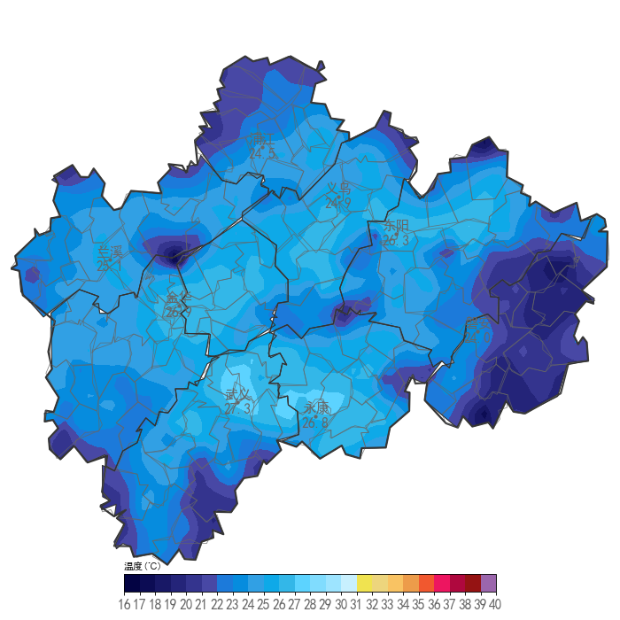

# weather-map-renderer

[](https://www.python.org/)
[](https://fastapi.tiangolo.com/)
[](LICENSE)

气象数据可视化地图图片渲染服务，基于 FastAPI + Matplotlib + Cartopy，将站点观测数据、NC 格点数据渲染为可视化地图图片。

**English**: Weather data visualization map rendering service based on FastAPI + Matplotlib + Cartopy. Renders station observation data and NC grid data into visualized map images.

## 效果展示

### 温度填色图



## 功能特性

- 站点离散点数据填色图（温度、降水、风速、能见度等）
- NC 格点数据渲染
- 雷达/卫星数据叠加
- 自动缓存 + TTL 过期清理
- 多进程渲染，支持并发请求
- SM4 加密数据传输

## 环境要求

- **Python**: 3.10 或 3.11（不支持 3.12+）
- **包管理器**: [uv](https://docs.astral.sh/uv/)（推荐）或 pip

## 快速开始

### 本地开发

```bash
# 1. 安装 uv（如果还没装）
# Windows PowerShell:
powershell -ExecutionPolicy ByPass -c "irm https://astral.sh/uv/install.ps1 | iex"
# macOS/Linux:
curl -LsSf https://astral.sh/uv/install.sh | sh

# 2. 克隆项目后进入目录
cd weather-map-renderer

# 3. 创建虚拟环境并安装依赖
uv sync

# 4. 安装开发依赖（可选）
uv sync --dev

# 5. 配置环境变量
cp .env.example .env
# 用编辑器打开 .env 填入实际配置

# 6. 启动服务
uv run uvicorn main:app --host 0.0.0.0 --port 8001 --reload
```

服务启动后访问：
- API 文档：http://localhost:8001/docs
- ReDoc 文档：http://localhost:8001/redoc

### Docker 部署

```bash
# 构建并启动
docker compose up -d

# 查看日志
docker compose logs -f

# 停止
docker compose down
```

## 开发命令

```bash
# 代码格式化
uv run ruff format .

# 代码检查
uv run ruff check .

# 类型检查
uv run mypy .

# 运行测试
uv run pytest tests/ -v

# 运行测试并生成覆盖率
uv run pytest tests/ -v --cov=.
```

## API 接口

### GET - 获取气象图片

```
GET /api/pic/{code}/{datestr}/{data_type}/{axis}
```

| 参数 | 说明 | 示例 |
|------|------|------|
| code | 行政区号6位 | 330100 |
| datestr | 日期时间 | 20260510080000 |
| data_type | 数据类型 | tem / rain / wind |
| axis | 数据别名 | TEM_H_POINT |

常用查询参数：

| 参数 | 默认值 | 说明 |
|------|--------|------|
| show_contourf | true | 显示填色图 |
| show_value | true | 显示站点数值 |
| show_town | true | 显示乡镇边界 |
| show_wind | false | 显示风向杆 |
| is_clip | true | 裁剪图片 |
| width | 700 | 图片宽度 |
| height | 700 | 图片高度 |

完整参数列表参见 `/docs` 页面。

### POST - 提交数据渲染

```
POST /api/pic/{code}/{data_type}
```

请求体为 JSON，包含站点数据数组。POST 请求自动保存图片文件，返回文件 ID。

#### 请求体格式

```json
{
  "data": [
    {
      "Station_Id_C": "K0001",
      "Station_Name": "示例站点",
      "Cnty": "某区",
      "City": "某市",
      "Admin_Code_CHN": "330100",
      "Town": "-",
      "V": "25.0",
      "Lon": "120.0000",
      "Lat": "30.0000",
      "Province": "某省",
      "Datetime": "2026-05-07 08:00:00"
    }
  ],
  "datestr": "20260507080000",
  "gen_all": true,
  "is_has_data": true,
  "show_contourf": true,
  "show_value": true,
  "show_point": true,
  "show_town": true,
  "show_town_name": true,
  "is_clip": true,
  "width": 700,
  "height": 700
}
```

#### 数据字段说明

| 字段 | 类型 | 必填 | 说明 |
|------|------|------|------|
| `Station_Id_C` | string | 是 | 站点编号，如 `"K0001"` |
| `Station_Name` | string | 是 | 站点名称，如 `"示例站点"` |
| `Cnty` | string | 是 | 区县名称 |
| `City` | string | 是 | 市级名称 |
| `Admin_Code_CHN` | string | 是 | 行政区划代码（6位），如 `"330100"` |
| `Town` | string | 否 | 乡镇名称，无乡镇填 `"-"` 或 `null` |
| `V` | string | 是 | 观测值，如温度 `"25.0"`、降雨量 `"12.0"` |
| `Lon` | string | 是 | 经度，如 `"120.0000"` |
| `Lat` | string | 是 | 纬度，如 `"30.0000"` |
| `Province` | string | 否 | 省份名称 |
| `Datetime` | string | 否 | 观测时间 |
| `D` | string | 风速专用 | 风向角度（0-360），仅风要素需要 |

> 项目根目录的测试数据文件可作为参考样例。

#### 渲染参数说明

| 参数 | 类型 | 默认值 | 说明 |
|------|------|--------|------|
| `gen_all` | bool | false | 是否生成所有下级区划（市级→区县，区级→乡镇） |
| `is_has_data` | bool | false | 数据来源于 POST body（与 GET 模式互斥） |
| `show_contourf` | bool | true | 显示填色图 |
| `show_value` | bool | true | 显示站点数值标签 |
| `show_point` | bool | false | 显示站点位置标记点 |
| `show_town` | bool | false | 显示乡镇边界 |
| `show_town_name` | bool | false | 显示乡镇名称 |
| `show_wind` | bool | false | 显示风向杆（风要素专用） |
| `is_clip` | bool | true | 按行政区边界裁剪图片 |
| `hide_rain_zero` | bool | false | 隐藏零值站点（降雨要素专用） |
| `show_name` | bool | 市级 true / 区级 false | 显示站点名称 |
| `width` | int | 700 | 图片宽度（px） |
| `height` | int | 700 | 图片高度（px） |
| `datestr` | string | - | 数据时间，用于生成文件名 |
| `color` | string | - | 色标编号（降雨要素专用，如 `"1"`） |

#### 响应格式

```json
{
  "DS": [
    {"330100": "c70f38239f09abae_330100.png"},
    {"330101": "66bafb016673aa5a_330101.png"},
    {"330102": "7922147451536887_330102.png"}
  ],
  "returnCode": "0",
  "returnMessage": "成功"
}
```

`DS` 为数组，包含每个区划代码对应的图片 ID。`gen_all=true` 时返回多张图片，失败项的值为 `null`。

#### 数据类型映射

| data_type | 说明 | 对应请求参数 |
|-----------|------|-------------|
| `tem` | 温度 | - |
| `rain` | 降雨 | `hide_rain_zero: true`, `color: "1"` |
| `wind` | 风 | `show_wind: true` |
| `vis` | 能见度 | - |
| `rh` | 湿度 | - |

### 获取已保存图片

```
GET /api/pic/img/{id}
```

## 配置说明

所有配置通过环境变量注入，前缀为 `PYDRAW_`，支持 `.env` 文件。

| 环境变量 | 默认值 | 说明 |
|----------|--------|------|
| `PYDRAW_BASE_PATH` | `/home/lizhan/weather-map-renderer` | 基础路径 |
| `PYDRAW_WIDTH` | 700 | 图片默认宽度 |
| `PYDRAW_HEIGHT` | 700 | 图片默认高度 |
| `PYDRAW_CACHE_TTL` | 300 | 缓存过期时间（秒） |
| `PYDRAW_CACHE_MAX_FILES` | 500 | 最大缓存文件数 |
| `PYDRAW_RENDER_WORKERS` | 0 | 渲染进程数（0=自动） |
| `PYDRAW_RENDER_MAX_WORKERS` | 4 | 进程池最大工作数 |
| `PYDRAW_SHAPE_PATH` | | Shapefile 目录（留空用默认） |
| `PYDRAW_IMG_PATH` | | 图片输出目录（留空用默认） |
| `PYDRAW_LOG_PATH` | | 日志目录（留空用默认） |
| `PYDRAW_DATA_SERVICE_URL` | | 数据服务 URL |
| `PYDRAW_DATA_SERVICE_KEY` | | SM4 加密密钥 |
| `PYDRAW_DATA_SERVICE_SIGN_KEY` | | SM4 签名密钥 |

## 项目结构

```
weather-map-renderer/
├── main.py                 # 应用入口
├── manage.py               # FastAPI 应用工厂
├── pyproject.toml          # 项目配置（依赖、工具）
├── api/                    # API 层（参数接收和响应）
│   └── img_v2.py           # 图片路由
├── models/                 # 数据模型层
│   └── base.py             # 请求/响应模型
├── services/               # 业务逻辑层
│   ├── data_service.py     # 数据获取与处理
│   ├── shape_service.py    # Shapefile 读取与缓存
│   └── render_service.py   # 渲染管线 + 缓存管理
├── rendering/              # 渲染引擎（子进程执行）
│   ├── worker.py           # 渲染 Worker
│   └── layers/             # 图层模块
├── config/                 # 配置（只读）
│   └── settings.py         # 全局配置
├── util/                   # 工具函数
│   ├── interpolate.py      # 插值算法
│   ├── sm4.py              # SM4 加解密
│   └── trace.py            # 链路追踪
├── font/                   # 字体资源
├── zjaws/                  # Shapefile 数据
└── static/                 # 静态文件
```

## 性能参考

| 场景 | 并发数 | 平均耗时 | 吞吐量 |
|------|--------|----------|--------|
| 缓存命中 | 100 | 0.44s | 195 req/s |
| 无缓存渲染 | 10 | 1.32s | 6.3 req/s |

测试环境：4 渲染进程，28 核 CPU，2GB 内存。

## 技术栈

| 类别 | 技术 |
|------|------|
| Web 框架 | FastAPI + Uvicorn |
| 地图渲染 | Matplotlib + Cartopy |
| 空间计算 | Shapely + SciPy |
| 数据加密 | gmalglib (SM4) |
| 配置管理 | pydantic-settings |
| 包管理 | uv |
| 代码规范 | Ruff (Lint + Format) |

## 依赖说明

本项目使用 `uv` 进行依赖管理，依赖定义在 `pyproject.toml` 中：

- **运行时依赖**: `[project.dependencies]`
- **开发依赖**: `[dependency-groups.dev]`

添加/移除依赖：

```bash
# 添加运行时依赖
uv add <package>

# 添加开发依赖
uv add --dev <package>

# 移除依赖
uv remove <package>
```

## License

[MIT](LICENSE)
